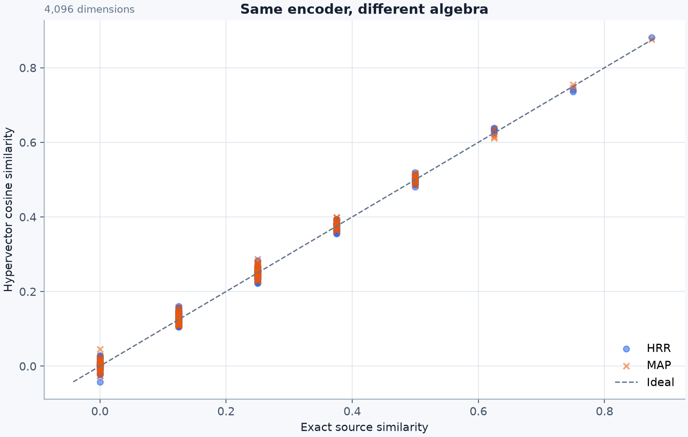
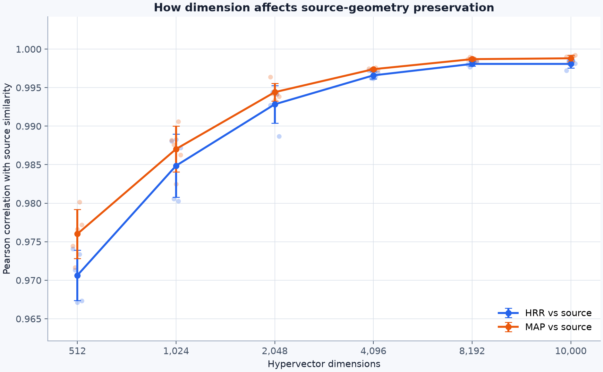

# Comparing HRR and MAP for similarity search over structured records

When working with HDC, we perform associative search by finding similar hypervectors.

However, similarity search over structured data begins with a modeling decision: how
should we capture the tea's attributes in a way that we actually model the similarity well?

HDC provides multiple algebras for modeling those attributes. This repository
compares two of them: Holographic Reduced Representations (HRR) and
Multiply-Add-Permute (MAP). HRR uses real numbers, stored as floats, for the
hypervectors' values. MAP uses bipolar integers ($\pm1$). Those different values
lead the two algebras to expose different mathematical operations.[^applications]

The purpose of this repository is to run a small experiment showing how, despite
using different mathematics under the hood, HRR and MAP can implement the same
logical encoder. The workflow is designed to generalize, so you can adapt it to
test:

- whether both algebras capture the expected similarities in your data, making
  the algebra a _design choice_, without changing the underlying relationships
  in the representation
- how hypervector dimensionality affects the result from 512 to 10,000
  dimensions. You don't always need to model hypervectors with 10,000 dimensions.

## What does it mean for two VSA algebras to represent the same data?

Recall that HRR and MAP use different numerical values and operations to perform the same
encoding task:

| Property | HRR | MAP |
| --- | --- | --- |
| Hypervector values | Real-valued | Bipolar |
| Binding | Circular convolution | Element-wise multiplication |
| Bundling | Addition | Addition |

Although the numerical forms (and the binding operations) differ. The key abstraction
for binding in the code is simple: you combine a field with its value so the pair can
be bundled into one hypervector that represents the full record.

### Research question

> Can the same logical encoder be implemented using HRR or MAP without changing
> the relationships it is intended to represent?

We address the question with a small dataset of tea records (20 records in total).
Two samples records are shown below:

```json
[
  {
    "sample_id": "T12",
    "name": "Dong Ding",
    "tea_type": "oolong",
    "origin": "Taiwan",
    "oxidation": "medium",
    "roast": "medium",
    "aroma_notes": ["roasted nuts", "honey", "orchid"],
    "elevation_m": 800
  },
  {
    "sample_id": "T13",
    "name": "Oriental Beauty",
    "tea_type": "oolong",
    "origin": "Taiwan",
    "oxidation": "high",
    "roast": "light",
    "aroma_notes": ["honey", "muscatel", "floral"],
    "elevation_m": 600
  }
]
```

No prior knowledge of tea is required to understand the workflow 😄. Tea is described
using metadata fields that express its aroma notes, origin, oxidation, and the elevation it grows at.
Both examples above describe oolong teas from Taiwan, and the elevations fall into the
same 500-meter bin, with some overlap in the aroma notes. However, they differ in oxidation,
roast, and the remaining aroma notes.

The `0.5` score comes from **exact source similarity**, not a learned or semantic
judgment about tea. The metric is cosine similarity over a binary indicator
space of field-value facts. Each record contributes eight equally weighted
facts: tea type, origin, oxidation, roast, one elevation bin, and three aroma
notes.

This pair shares four of those eight facts:

| Shared field | Matching value |
| --- | --- |
| `tea_type` | `oolong` |
| `origin` | `taiwan` |
| `elevation_m` | `[500,1000)` |
| `aroma_notes` | `honey` |

Both records contain eight facts, so their score is:

$$
\frac{4}{\sqrt{8 \times 8}} = \frac{4}{8} = 0.5
$$

Different oxidation and roast values receive no partial credit, and neither do
the remaining aroma notes. The deliberately strict baseline tells us exactly
which relationships the HRR and MAP hypervectors are expected to reproduce. See
[`METHODOLOGY.md`](METHODOLOGY.md) for the complete encoder design and
field-by-field definition.

## Run the experiment

Install the exact locked environment:

```bash
uv sync
```

Then read and run the four scripts in order:

```bash
uv run src/01_make_demo_data.py
uv run src/02_encode.py
uv run src/03_evaluate.py
uv run src/04_dimension_sweep.py
```

Each script has a short block of editable constants near the top. Running these
four scripts directly is the complete workflow.

### 1. Create the dataset

[`01_make_demo_data.py`](src/01_make_demo_data.py) loads the 20 records from
[`data/raw/tea-samples.json`](data/raw/tea-samples.json) through Polars and
writes them to LanceDB. The JSON file is the source of truth and is meant to be
readable without specialized tooling.

### 2. Encode the records twice

[`02_encode.py`](src/02_encode.py) creates one HRR algebra and one MAP algebra,
then passes every record through the shared record-to-hypervector pipeline in
[`encoding/encoder.py`](src/encoding/encoder.py). The script stores one HRR
hypervector column and one MAP hypervector column in LanceDB, then writes
`artifacts/encoded.parquet` for inspection.

The pipeline performs the same work for both algebras:

```text
record
  -> exact (field, value) terms
  -> bind each field to its value
  -> bundle the bound facts
  -> normalize the record hypervector
```

The field-value mapping, bundling, and normalization do not change. Only `bind`
and the hypervectors assigned to each field and value differ. The implementations
live in [`hrr.py`](src/algebra/hrr.py) and [`map.py`](src/algebra/map.py).

### 3. Compare similarity and retrieval

[`03_evaluate.py`](src/03_evaluate.py) compares every record pair in three
ways: exact source similarity, HRR cosine similarity, and MAP cosine similarity.
The dashed line in the figure is the ideal `hypervector similarity = source
similarity` relationship.



The points fall into vertical bands because source overlap can only change in
whole terms. At 4,096 dimensions, both point clouds stay close to the ideal
line. Small deviations, including slightly negative cosines for some pairs with
zero shared terms, come from residual interference among the random field-value
hypervectors sharing a finite number of coordinates.

The current run uses seed 2,026 and produces:

| Measurement | Result |
| --- | ---: |
| HRR correlation with source similarity | 0.9972 |
| MAP correlation with source similarity | 0.9975 |
| HRR correlation with MAP | 0.9945 |
| HRR mean absolute error from source | 0.0105 |
| MAP mean absolute error from source | 0.0101 |

Correlation answers whether the pairwise relationships rise and fall together.
Mean absolute error answers the complementary question of how far the encoded
similarities sit from their intended values. Both measures tell the same story
for this run: each algebra closely recovers the source-defined pairwise scores,
and the observed difference between them is small on these 20 records.

The script also queries the LanceDB storage layer for the top four neighbors of six fixed queries.
Raw overlap requires HRR and MAP to return the same record IDs. Tie-aware
overlap accepts a different ID when both candidates have equal source
similarity to the query.

| Retrieval measurement | Result |
| --- | ---: |
| Raw top-4 overlap | 0.9167 |
| Tie-aware top-4 overlap | 1.0000 |
| Disagreements inside source ties | 2 of 2 |

The raw disagreements occur for queries T08 and T20. In both cases, HRR and MAP
choose different records from the same source-similarity tier. Small differences
in the stored hypervectors change which tied ID comes first, but not the
source-similarity tier defined by this dataset.

### 4. Sweep dimensions

> [!NOTE]
> Do you really need 10,000 dimensions in your hypervectors? For any dataset, it's
> worth running a dimensionality sweep experiment like the one shown below to
> understand the impact of a) dimensionality and b) random seed on results.

[`04_dimension_sweep.py`](src/04_dimension_sweep.py) repeats the pairwise
source-similarity benchmark across **6** dimensions and **5** random seeds. The
dataset, record order, term vocabulary, field weights, and source baseline stay
fixed. Only dimension and seed are changed.



At each dimension, the script encodes the dataset five times, once per random
seed. Each faint point is the Pearson correlation between the exact source
similarities and either the HRR or MAP cosine similarities for every record pair
in one seeded run. Each solid point, also reported in the table below, is the
arithmetic mean of those five correlations. The error bar extends one sample
standard deviation above and below that mean. The vertical axis is deliberately
zoomed, so the visible gap between curves is much smaller than it first appears.

| Dimensions | HRR vs source | MAP vs source |
| ---: | ---: | ---: |
| 512 | 0.9706 | 0.9760 |
| 1,024 | 0.9849 | 0.9870 |
| 2,048 | 0.9928 | 0.9944 |
| 4,096 | 0.9966 | 0.9974 |
| 8,192 | 0.9981 | 0.9987 |
| 10,000 | 0.9981 | 0.9988 |

The largest gains come as hypervectors grow to 2,048 dimensions. Improvement continues after
that point, but the curve is already flattening and variation across seeds is
small. We therefore treat 2,048 dimensions as the empirical knee for this
workload and 4,096 as a conservative default. The recommendation is a
property of this dataset and field mapping, not a general capacity rule for HRR
or MAP.

## What the experiment supports

The results support one focused claim: for this shallow bundle of exact
field-value facts, both HRR and MAP closely preserve the source-defined pairwise
similarities and produce source-equivalent top-k retrieval results.

The experiment does not show that HRR and MAP are generally interchangeable.
It does not evaluate unbinding quality, nested structures, ordered sequences,
permutation, learned field and value hypervectors, index build time, query
latency, storage footprint, or hardware cost. Those are precisely the kinds of
requirements that can make the choice of algebra matter. The fixed
record-to-hypervector pipeline gives us a clean place to add such tests later
without also changing what the records mean.

Running all four scripts creates the following artifacts that contain the raw outputs:

```text
artifacts/
├── encoded.parquet
├── metrics.json
├── pairwise.parquet
├── retrieval.parquet
├── retrieval-disagreements.parquet
├── sweep.parquet
└── figures/
    ├── similarity-comparison.png
    └── dimension-sweep.png
```

## Try another dataset

The comparison becomes more useful when the source semantics change. To adapt
the experiment to another small categorical dataset:

1. Replace the raw JSON and update the paths at the top of
   [`01_make_demo_data.py`](src/01_make_demo_data.py).
2. Edit `record_terms()` in [`encoding/terms.py`](src/encoding/terms.py) so one
   record becomes the intended `(field, value)` facts.
3. Update the ID or table constants in
   [`storage/ingest.py`](src/storage/ingest.py) if necessary.
4. Run the same four scripts again. Every result table and both figures will be
   regenerated.

The dataset-specific code decides which facts matter. The shared pipeline and
the two algebra implementations remain unchanged.

For independent review, inspect whether the source formula in
[`METHODOLOGY.md`](METHODOLOGY.md) matches the intended semantics, whether
source ties really make neighbors interchangeable for the application, and
whether the dimension recommendation remains explicitly workload-specific.
[`AGENTS.md`](AGENTS.md) documents the repository structure and development
commands.

The project uses NumPy, PyArrow, Polars, and TorchHD.

[^applications]: HRR was introduced as a real-valued associative-memory scheme
    for variable bindings, sequences, and frame-like structures in
    [Plate's original paper](https://doi.org/10.1109/72.377968). HRR-derived
    semantic pointers have since been used in
    [neural and cognitive models](https://doi.org/10.1371/journal.pone.0149928),
    while related circular-correlation methods have been applied to
    [knowledge-graph link prediction](https://doi.org/10.1609/aaai.v30i1.10314).
    MAP has continuous, bipolar, and integer variants; the bipolar operations
    used here also appear in work on
    [joint communication and classification](https://doi.org/10.1186/s40708-021-00138-0).
    A broader comparison evaluates HRR and MAP on
    [visual place and language recognition](https://doi.org/10.1007/s10462-021-10110-3).
    These examples are application history, not exclusive boundaries between
    the algebras.
